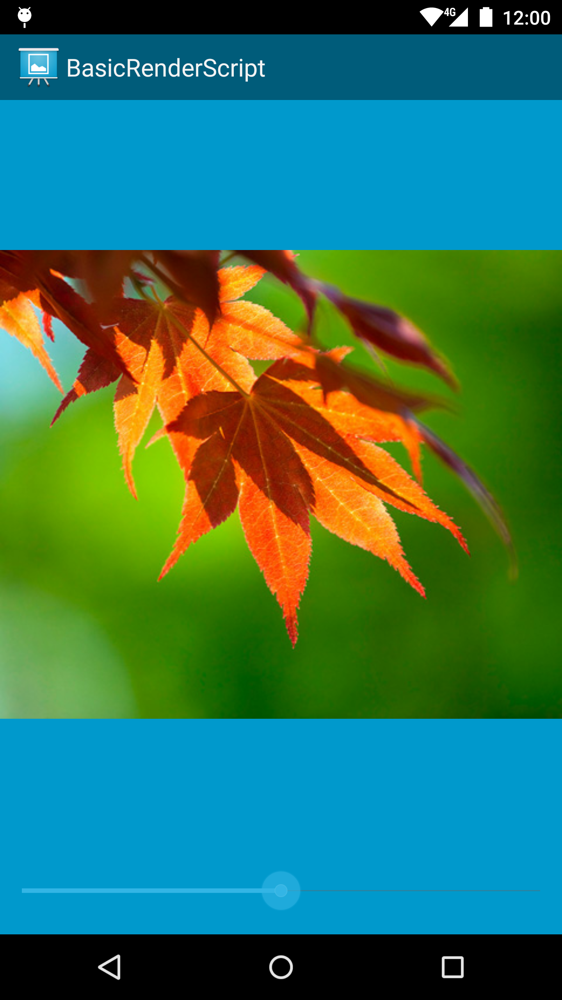

Android BasicRenderScript Sample
===================================

This sample demonstrates using RenderScript to perform basic image manipulation. Specifically, it allows users
to dynamically adjust the saturation for an image using a slider. A custom RenderScript kernel performs the saturation
adjustment, running the computation on the device\'s GPU or other compute hardware as deemed appropriate by the system.

Introduction
------------

[RenderScript][1] is a framework for running computationally intensive tasks at high performance on Android. RenderScript is
primarily oriented for use with data-parallel computation, although serial computationally intensive workloads can
benefit as well.

The RenderScript runtime will parallelize work across all processors available on a device, such as multi-core CPUs,
GPUs, or DSPs, allowing you to focus on expressing algorithms rather than scheduling work or load balancing.
RenderScript is especially useful for applications performing image processing, computational photography, or computer
vision.

This sample demonstrates the fundamentals of writing a RenderScript compute kernel, and using it to perform basic image
manipulation. In this case, each pixel is transformed based on a liner interpolation between its original
RGB value and it's luminance (black-and-white) value, weighted based on the user's specified saturation target.

[1]: http://developer.android.com/guide/topics/renderscript/compute.html
[2]: http://developer.android.com/reference/renderscript/rs__cl_8rsh.html#a254612a612ff7539b01a1478e03d8697

Pre-requisites
--------------

- Android SDK 28
- Android Build Tools v28.0.3
- Android Support Repository

Screenshots
-------------

 

Getting Started
---------------

This sample uses the Gradle build system. To build this project, use the
"gradlew build" command or use "Import Project" in Android Studio.

Support
-------

- Stack Overflow: http://stackoverflow.com/questions/tagged/android

If you've found an error in this sample, please file an issue:
https://github.com/android/renderscript

Patches are encouraged, and may be submitted by forking this project and
submitting a pull request through GitHub. Please see CONTRIBUTING.md for more details.
