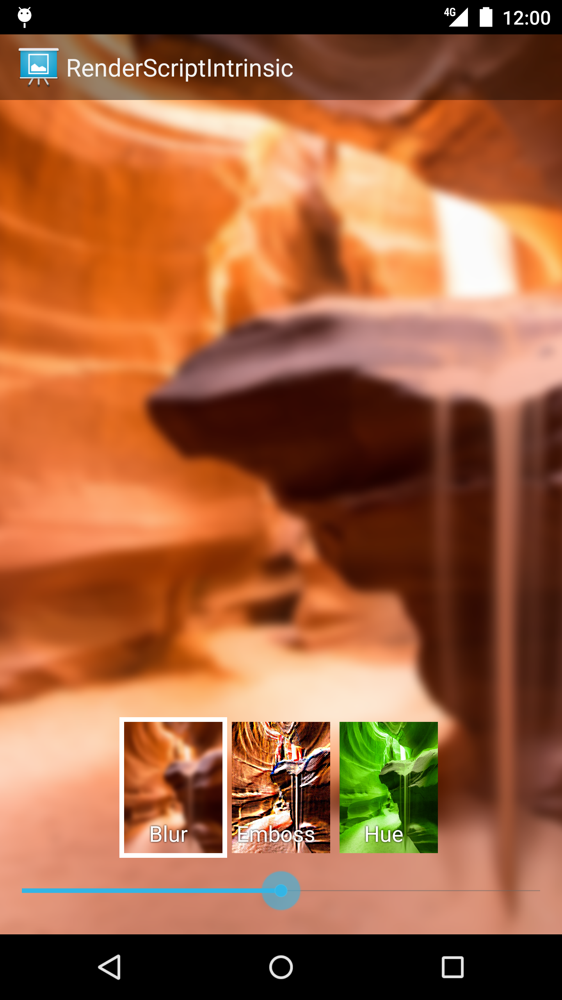

Android RenderScriptIntrinsic Sample
===================================

RenderScriptIntrinsic sample that demonstrates how to use RenderScript intrinsics.
Creates several RenderScript intrinsics and shows a filtering result with various parameters.
Also shows how to extends RedioButton with StateListDrawable.

Introduction
------------

[RenderScript][1] is a framework for running computationally intensive tasks at high performance on
Android. RenderScript is primarily oriented for use with data-parallel computation, although serial
computationally intensive workloads can benefit as well.

RenderScript **intrinsics** are built-in functions that perform well-defined operations often seen
in image processing. Intrinsics provide extremely high-performance implementations of standard
functions with a minimal amount of code.

This sample shows how to access and use the blur, convolve, and matrix intrinsics:

```java
mScriptBlur = ScriptIntrinsicBlur.create(mRS, Element.U8_4(mRS));
mScriptConvolve = ScriptIntrinsicConvolve5x5.create(mRS,
        Element.U8_4(mRS));
mScriptMatrix = ScriptIntrinsicColorMatrix.create(mRS,
        Element.U8_4(mRS));
```

RenderScript intrinsics will usually be the fastest possible way for a developer to perform these
operations. The Android team works closely with our partners to ensure that the intrinsics perform
as fast as possible on their architectures — often far beyond anything that can be achieved in a
general-purpose language.

[1]: http://developer.android.com/guide/topics/renderscript/compute.html

Pre-requisites
--------------

- Android SDK 28
- Android Build Tools v28.0.3
- Android Support Repository

Screenshots
-------------

 

Getting Started
---------------

This sample uses the Gradle build system. To build this project, use the
"gradlew build" command or use "Import Project" in Android Studio.

Support
-------

- Stack Overflow: http://stackoverflow.com/questions/tagged/android

If you've found an error in this sample, please file an issue:
https://github.com/android/renderscript

Patches are encouraged, and may be submitted by forking this project and
submitting a pull request through GitHub. Please see CONTRIBUTING.md for more details.
