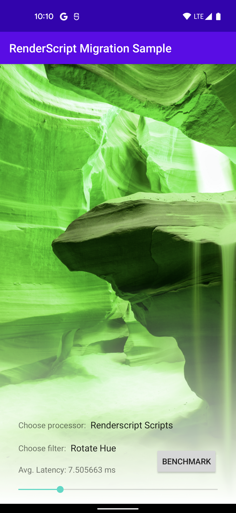
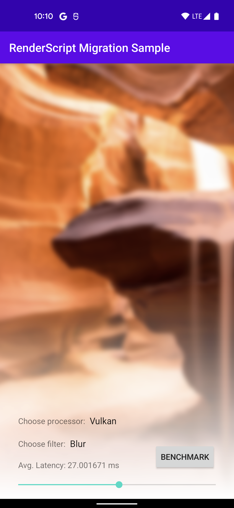

# RenderScriptMigration Sample

## Introduction

[RenderScript is being deprecated](https://android-developers.googleblog.com/2021/04/android-gpu-compute-going-forward.html) since Android 12. We recommend computationally intensive applications to use [Vulkan](https://www.khronos.org/vulkan), the cross platform industry standard API. Please refer to the [RenderScript Migration Guide](https://developer.android.com/guide/topics/renderscript/migrate) for more details.

To help developers migrate, this sample is created to demonstrate how to apply image filtering to a bitmap with Renderscript Intrinsics, Renderscript Scripts, Vulkan compute pipeline, GLSL compute (in Kotlin). Since the two effects demonstrated can also be implemented using the platform RenderEffect, this is also demonstrated. The sample creates a common ImageProcessor interface that performs two compute tasks:
- HUE rotation: A simple compute task with a single compute kernel.
- Blur: A more complex compute task which executes two compute kernels sequentially.

Both tasks are implemented with RenderScript (intrinsics & custom scripts), GLSL, and Vulkan to demonstrate the migration from RenderScript to Vulkan or GLSL Compute pipelines.

## Pre-requisites

- Android Studio Flamingo 2022.2.1+
- SDK Build Tools 34.0.0+
- NDK 22.0.7026061
- Android API 33+

## Getting Started

1. Download Android Studio.
2. Launch Android Studio.
3. Open the sample directory.
4. Click Tools/Android/Sync Project with Gradle Files.
5. Click Run/Run 'app'.

## Screenshots

## Support

We highly recommend to use [Stack Overflow](http://stackoverflow.com/questions/tagged/android) to get help from the Android community.

If you've found an error in this sample, please file an issue:
https://github.com/android/renderscript-samples

Patches are encouraged, and may be submitted by forking this project and
submitting a pull request through GitHub.
